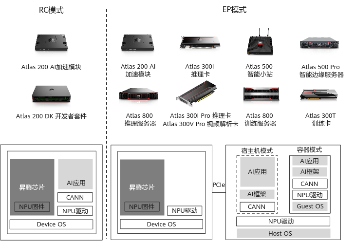

# 昇腾产品工作模式

[信息来源](https://support.huaweicloud.com/instg-cli-cann504-alpha002/atlasdeploy_03_0088.html)

Ascend 芯片的PCIe工作模式分为RC和EP两种。

  - RC：PCIe工作在主模式，可以扩展外设

    产品的CPU直接运行用户指定的AI业务软件，接入网络摄像头、I2C传感器、SPI显示器等其他外挂设备作为从设备接入产品。

  - EP：PCIe工作在从模式

    EP模式通常由Host侧作为主端，Device侧作为从端。客户的AI业务程序运行在Host系统中，产品作为Device系统以PCIe从设备接入Host系统，Host系统通过PCIe通道与Device系统交互，将AI任务加载到Device侧的昇腾 AI 处理器中运行。

Host和Device的概念说明如下：

  - Host：是指与昇腾AI处理器所在硬件设备相连接的X86服务器、ARM服务器，利用昇腾AI处理器提供的NN（Neural-Network）计算能力完成业务。

  - Device：是指安装了昇腾AI处理器的硬件设备，利用PCIe接口与服务器连接，为服务器提供NN计算能力。

昇腾 AI 处理器的工作模式如下：

  - 昇腾310 有EP和RC两种模式。
  - 昇腾710 只有EP模式。
  - 昇腾910 只有EP模式。

具体分类:

