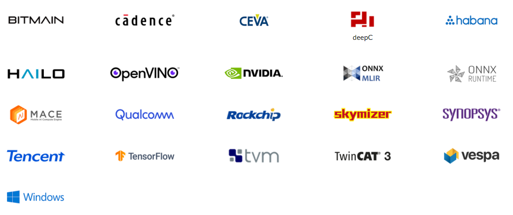
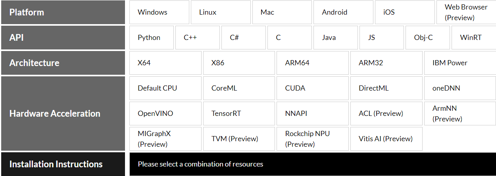
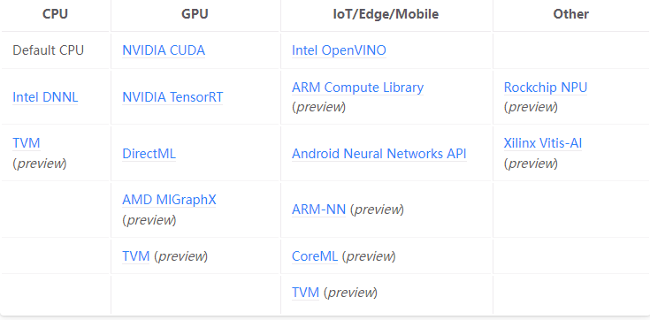

# ONNX社区

ONNX(Open Neural Network Exchange)是一种针对机器学习所设计的开放式的文件格式，用于存储训练好的模型。它使得不同的人工智能框架（如Pytorch、MXNet）可以采用相同格式存储模型数据并交互。

2017年，ONNX开源社区由微软和Facebook公司共同发起，托管在Github上。

2019年正式加入LF AI & DATA基金会。

Apache 2.0 License

## 社区治理

### 角色

- Member
  - 感兴趣、参与讨论的人

- Contributor
  - 提交、review PR
  - 提交、评论issue
  - 参与SIG、推广ONNX
  - 由两个来自不同公司的Approver提名，1年不活跃会被移除

- Approver
  - 活跃大于3个月
  - 由SIG chair提名

- Member Companies
  - 赞助onnx的公司
  - 参与onnx贡献的公司
  - 举行onnx活动的公司
  - 发布onnx产品的公司

### 机构

- Steering Committee
  - onnx社区管理
- Special Interest Groups (SIGs)
  - 项目开发、管理

- Working Groups
  - 跨SIG合作

#### Steering Committee

由5名成员组成。任何单一会员公司不得有多于一名代表。成员任期一年。

| Term | Members |
| ---- | ------- |
| **Current** June 1, 2021 - May 31, 2022 | [Prasanth Pulavarthi](https://github.com/prasanthpul) (Microsoft) [Alexandre Eichenberger](https://github.com/AlexandreEichenberger) (IBM) [Rajeev Nalawadi](https://github.com/rajeevnalawadi) (Intel) [Mayank Kaushik](https://github.com/mk-nvidia) (Nvidia) [Wenming Ye](https://github.com/wenming) (Amazon) |
| June 1, 2020 - May 31, 2021 | [Prasanth Pulavarthi](https://github.com/prasanthpul) (Microsoft) [Harry Kim](https://github.com/harryskim) (Intel) [Jim Spohrer](https://github.com/jimspohrer) (IBM) [Joohoon Lee](https://github.com/joohoon) (Nvidia) [Sheng Zha](https://github.com/szha) (Amazon) |
| June 1, 2019 - May 31, 2020 |[Prasanth Pulavarthi](https://github.com/prasanthpul) (Microsoft) [Joe Spisak](https://github.com/jspisak) (Facebook) [Vin Sharma](https://github.com/ciphr) (Amazon) [Harry Kim](https://github.com/harryskim) (Intel) [Dilip Sequeira](https://github.com/DilipSequeira) (Nvidia) |

#### SIGs

- Architecture & Infra: ONNX规范、CI/CD
- Operators: 算子的标准和规范
- Converters: 模型转换器
- Models and tutorials: 模型管理和社区教程

#### Working Groups

| Working Group      | Objectives    |
| ------------------ | ------------- |
| [Release](https://lfaifoundation.slack.com/archives/C018VGGJUGK) | Improve the release process for ONNX |
| [Training](https://lfaifoundation.slack.com/archives/C018K560U14) | Expand ONNX to support training as well as inference |
| [Preprocessing](https://lfaifoundation.slack.com/archives/C02AANGFBJB) | Make data preprocessing part of ONNX |

## ONNX社区核心项目

- [onnx](https://github.com/onnx/onnx)

  onnx模型定义

- [onnx-mlir](https://github.com/onnx/onnx-mlir)

  MLIR的onnx支持

- [ONNX Model Zoo](https://github.com/onnx/models)
  
  ONNX官网提供的一些已经训练好的模型集合

- [ONNX Optimizer](https://github.com/onnx/optimizer)

  onnx模型优化器

- onnx与tensorflow、tensorrt、scikit-learn、Caffe2互相转换的库

## CI/CD

- [Azure Pipeline](https://dev.azure.com/onnx-pipelines/onnx)
- [Jenkins](https://www.onnxmlir.xyz/jenkins/)
- Github Action

## Meeting and MailList

https://wiki.lfaidata.foundation/pages/viewpage.action?pageId=18481196

## onnx runtime

### onnxruntime

微软开源的onnx runtime， MIT License

### ONNX Runtime for Training

直接训练出onnx模型，目前只支持pytorch
