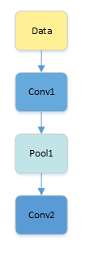
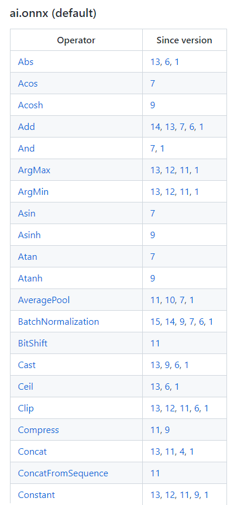
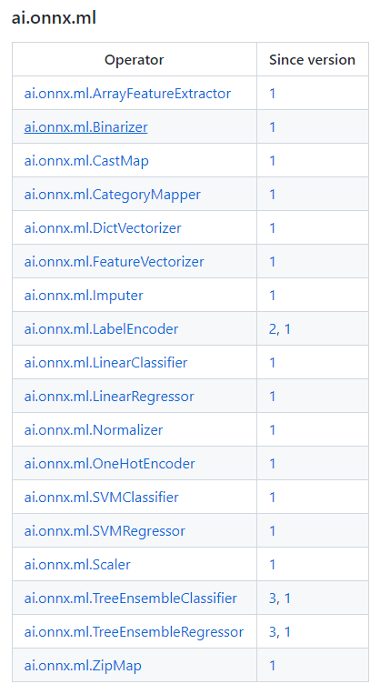
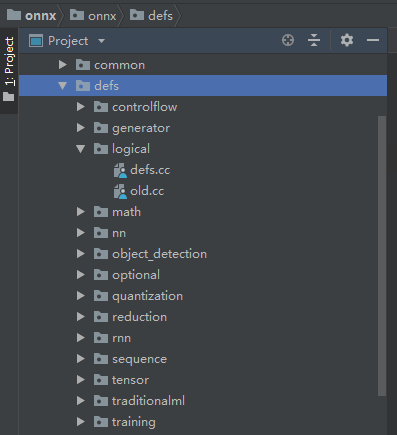

# Operator 算子

算子在数学中的定义：一个函数空间到函数空间上的映射O：X→X。

广义的讲，对任何函数进行某一项操作都可以认为是一个算子。比如微分算子，不定积分算子等。

在网络模型中，算子对应层中的计算逻辑，例如：卷积层（Convolution Layer）是一个算子；全连接层（Fully-connected Layer， FC layer）中的权值求和过程，是一个算子。

## 算子类型（type）

代表算子的类型，例如卷积算子的类型为Convolution，在一个网络中同一类型的算子可能存在多个。

## 算子名称（name）

算子的name，用于标志网络中的某个算子，同一网络中算子的名称需要保持唯一。如下图所示conv1，pool1，conv2都是此网络中的算子名称，其中conv1与conv2算子的类型为Convolution，表示分别做一次卷积运算。



## 张量（tensor）

tensor是算子操作的对象，是算子中的数据，包括输入数据与输出数据

# ONNX Operators&Operator sets

## Operator

### 算子属性：

Name|Type|Description
|---|---|---|
op_type|string|The name of the operator (case sensitive), as used in graph nodes. MUST be unique within the operator set’s domain.
since_version|int64|The version of the operator set when this operator was introduced.
status|OperatorStatus|One of ‘EXPERIMENTAL’ or ‘STABLE.’
doc_string|string|A human-readable documentation string for this operator. Markdown is allowed.

https://github.com/onnx/onnx/blob/main/docs/Operators.md 包含157个神经网络模型算子



https://github.com/onnx/onnx/blob/main/docs/Operators-ml.md 包含18个传统非神经网络机器学习模型算子



source defs：




## Operator sets

### 算子集属性：

Name|Type|Description
|---|---|---|
magic|string|The value ‘ONNXOPSET’
ir_version|int32|The ONNX version corresponding to the operators.
ir_version_prerelease|string|The prerelease component of the SemVer of the IR.
ir_build_metadata|string|The build metadata of this version of the operator set.
domain|string|The domain of the operator set. Must be unique among all sets.
opset_version|int64|The version of the operator set.
doc_string|string|Human-readable documentation for this operator set. Markdown is allowed.
operator|Operator[]|The operators contained in this operator set.

算子集由(domain, version)一对属性唯一标识

### domain

#### ai.onnx

是默认的算子集，主要针对神经网络模型。目前支持16个版本的算子集，详细参看：

https://github.com/onnx/onnx/blob/main/onnx/defs/operator_sets.h

#### ai.onnx.ml

主要适用于传统非神经网络机器学习模型。目前支持3个版本的算子集，详细参看：

https://github.com/onnx/onnx/blob/main/onnx/defs/operator_sets_ml.h

## ONNX Models

The top-level ONNX construct is a ‘Model’

模型结构的主要目的是将元数据(meta data)与图形(graph)相关联。

|Name|Type|Description|
|---|---|---|
|ir_version|int64|The ONNX version assumed by the model.|
|opset_import|OperatorSetId|A collection of operator set identifiers made available to the model. An implementation must support all operators in the set or reject the model.|
|producer_name|string|The name of the tool used to generate the model.|
|producer_version|string|The version of the generating tool.|
|domain|string|A reverse-DNS name to indicate the model namespace or domain, for example, 'org.onnx'|
|model_version|int64|The version of the model itself, encoded in an integer.|
|doc_string|string|Human-readable documentation for this model. Markdown is allowed.|
|graph|Graph|The parameterized graph that is evaluated to execute the model.|
|metadata_props|map<string,string>|Named metadata values; keys should be distinct.|
|training_info|TrainingInfoProto[]|An optional extension that contains information for training.|
|functions|FunctionProto[]|An optional list of functions local to the model.|

## ONNX Graph

计算图(Graph，又称为数据流图)被定义为有向无环图，张量和算子都是图中的对象，算子是图的节点，张量是图的边上流动的数据。

|Name|Type|Description|
|---|---|---|
name|string|The name of the model graph.
node|Node[]|A list of nodes, forming a partially ordered computation graph based on input/output data dependencies. It is in topological order.
initializer|Tensor[]|A list of named tensor values. When an initializer has the same name as a graph input, it specifies a default value for that input. When an initializer has a name different from all graph inputs, it specifies a constant value. The order of the list is unspecified.
doc_string|string|Human-readable documentation for this model. Markdown is allowed.
input|ValueInfo[]|The input parameters of the graph, possibly initialized by a default value found in ‘initializer.’
output|ValueInfo[]|The output parameters of the graph. Once all output parameters have been written to by a graph execution, the execution is complete.
value_info|ValueInfo[]|Used to store the type and shape information of values that are not inputs or outputs.

## ONNX Nodes

计算节点，每个节点代表对算子或函数的调用。每个节点都有零个或多个输入和一个或多个输出。

Name|Type|Description
|---|---|---|
name|string|An optional name of the node, used for diagnostic purposes only.
input|string[]|Names of the values used by the node to propagate input values to the node operator. It must refer to either a graph input, a graph initializer or a node output.
output|string[]|Names of the outputs used by the node to capture data from the operator invoked by the node. It either introduces a  value in the graph or refers to a graph output.
op_type|string|The symbolic identifier of the operator to invoke.
domain|string|The domain of the operator set that contains the operator named by the op_type.
attribute|Attribute[]|Named attributes, another form of operator parameterization, used for constant values rather than propagated values.
doc_string|string|Human-readable documentation for this value. Markdown is allowed.

## example

```python
# Given a bool scalar input cond.
# return constant sequence x if cond is True, otherwise return constant sequence y.

then_out = onnx.helper.make_tensor_sequence_value_info('then_out', onnx.TensorProto.FLOAT, shape=[5])
else_out = onnx.helper.make_tensor_sequence_value_info('else_out', onnx.TensorProto.FLOAT, shape=[5])

x = [np.array([1, 2, 3, 4, 5]).astype(np.float32)]
y = [np.array([5, 4, 3, 2, 1]).astype(np.float32)]

then_const_node = onnx.helper.make_node(
    'Constant',
    inputs=[],
    outputs=['x'],
    value=onnx.numpy_helper.from_array(x[0])
)

then_seq_node = onnx.helper.make_node(
    'SequenceConstruct',
    inputs=['x'],
    outputs=['then_out']
)

else_const_node = onnx.helper.make_node(
    'Constant',
    inputs=[],
    outputs=['y'],
    value=onnx.numpy_helper.from_array(y[0])
)

else_seq_node = onnx.helper.make_node(
    'SequenceConstruct',
    inputs=['y'],
    outputs=['else_out']
)

then_body = onnx.helper.make_graph(
    [then_const_node, then_seq_node],
    'then_body',
    [],
    [then_out]
)

else_body = onnx.helper.make_graph(
    [else_const_node, else_seq_node],
    'else_body',
    [],
    [else_out]
)

if_node = onnx.helper.make_node(
    'If',
    inputs=['cond'],
    outputs=['res'],
    then_branch=then_body,
    else_branch=else_body
)

cond = np.array(1).astype(bool)
res = x if cond else y
expect(if_node, inputs=[cond], outputs=[res], name='test_if_seq',
       opset_imports=[onnx.helper.make_opsetid("", 13)])
```


