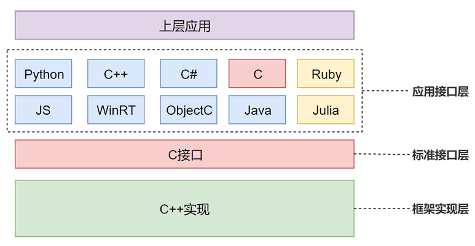
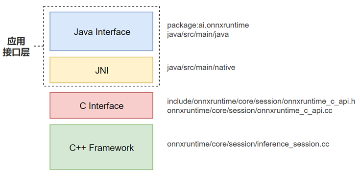

# 接口架构

ONNX Runtime为了支持丰富的上层应用，支持各种编程语言接口，包括Python、C、C++、C#、Java Script、Java、Object C、WinRT以及Ruby和Julia。

备注：Ruby和Julia为外部项目支持，调用的也是ONNX Runtime的C接口。



其接口层次如上图所示，分为：

1. 应用接口层：ONNX Runtime的北向面向上层应用的接口，支持各种编程语言，其南向调用标准C接口，应用接口层不需要感知框架的具体实现。
2. 标准接口层：南向调用框架层的C++接口，北向提供标准的统一C语言接口，主要用于对接不同的高级语言接口。
3. 框架实现层：实现ONNX Runtime的主要功能逻辑，包括加载模型、调用provider执行推理等，整体采用C++实现。

# Java接口实例走读

Java接口架构如下：


其主要层次包含了：
1. Java接口：向Java程序提供接口，主要实现在工程中的java/src/main/java目录中，打包在ai.onnxruntime中。示例代码如下：
```java
// 一、Java应用程序调用接口实现模型加载和推理
// 初始化ONNX Runtime运行环境变量，主要是获取日志接口，并创建运行时实例对象
var env = OrtEnvironment.getEnvironment();

// 创建推理会话，指定推理模型文件以及会话参数
var session = env.createSession("model.onnx",new OrtSession.SessionOptions());


// 运行会话，执行推理
OnnxTensor t1,t2;
var inputs = Map.of("name1",t1,"name2",t2);
try (var results = session.run(inputs)) {
    // manipulate the results
}
```

```java
// 二、Java接口中调用了native实现
// 初始化ONNX Runtime运行环境变量，主要是获取日志接口，并创建运行时实例对象
public class OrtSession implements AutoCloseable {
    ...
    // Java接口中调用了native接口用于创建ONNX Runtime会话session
    private static native long createSession(
      long apiHandle, long envHandle, String modelPath, long optsHandle) throws OrtException;
    ...
```

1. JNI层：主要提供C语言接口到Java接口的调用转换，主要实现在工程中的java/src/main/native路径下，如下示例中显示，其JNI接口内部调用的是C语言的CreateSession函数：

```c
JNIEXPORT jlong JNICALL Java_ai_onnxruntime_OrtSession_createSession__JJLjava_lang_String_2J
  (JNIEnv * jniEnv, jclass jclazz, jlong apiHandle, jlong envHandle, jstring modelPath, jlong optsHandle) {
    (void) jclazz; // Required JNI parameter not needed by functions which don't need to access their host object.
    const OrtApi* api = (const OrtApi*) apiHandle;
    OrtSession* session;

#ifdef _WIN32
    const jchar* cPath = (*jniEnv)->GetStringChars(jniEnv, modelPath, NULL);
    size_t stringLength = (*jniEnv)->GetStringLength(jniEnv, modelPath);
    wchar_t* newString = (wchar_t*)calloc(stringLength + 1, sizeof(wchar_t));
    if(newString == NULL) {
        throwOrtException(jniEnv, 1, "Not enough memory");
        return 0;
    }
    wcsncpy_s(newString, stringLength+1, (const wchar_t*) cPath, stringLength);

    // 调用C语言函数接口CreateSession创建会话
    checkOrtStatus(jniEnv,api,api->CreateSession((OrtEnv*)envHandle, newString, (OrtSessionOptions*)optsHandle, &session));
    free(newString);
    (*jniEnv)->ReleaseStringChars(jniEnv,modelPath,cPath);
#else
    const char* cPath = (*jniEnv)->GetStringUTFChars(jniEnv, modelPath, NULL);
    checkOrtStatus(jniEnv,api,api->CreateSession((OrtEnv*)envHandle, cPath, (OrtSessionOptions*)optsHandle, &session));
    (*jniEnv)->ReleaseStringUTFChars(jniEnv,modelPath,cPath);
#endif

    return (jlong) session;
}

```

3. C语言标准接口：向上层高级语言提供标准C接口，使高级语言不用关注框架实现层逻辑，主要实现在工程中的onnxruntime/core/session/onnxruntime_c_api.cc中
```c
ORT_API_STATUS_IMPL(OrtApis::CreateSession, _In_ const OrtEnv* env, _In_ const ORTCHAR_T* model_path,
                    _In_ const OrtSessionOptions* options, _Outptr_ OrtSession** out) {
  API_IMPL_BEGIN
  std::unique_ptr<onnxruntime::InferenceSession> sess;
  OrtStatus* status = nullptr;
  *out = nullptr;

  ORT_TRY {
    ORT_API_RETURN_IF_ERROR(CreateSessionAndLoadModel(options, env, model_path, nullptr, 0, sess));
    ORT_API_RETURN_IF_ERROR(InitializeSession(options, sess));

    *out = reinterpret_cast<OrtSession*>(sess.release());
  }
  ORT_CATCH(const std::exception& e) {
    ORT_HANDLE_EXCEPTION([&]() {
      status = OrtApis::CreateStatus(ORT_FAIL, e.what());
    });
  }

  return status;
  API_IMPL_END
}
```

4. C++框架实现：C++实现ONNX Runtime的主体框架，包括模型加载、调用provider计算、推理。主要包含了两个阶段：
   1. CreateSession：创建会话
       1. CreateSessionAndLoadModel：创建会话并加载模型
        具体流程包括：创建InferenSession对象，加载模型文件到会话中sess->Load进而创建了Model对象，Model对象中又创建了Graph对象。
       2. InitializeSession：初始化会话
        具体流程包括：创建Provider对象，并加载所有provider并注册到会话中，初始化会话sess->Initialize。
        在初始会话中创建SessionState对象，在SessionState对象初始化时设置会话的allocator对象装载对应Provider的GetAllocator方法获取地址。
        接下来会调用KernelRegistryManager，获取所有provider的KernelRegistry（调用GetKernelRegistry获取所有Provider支持的算子以及对应的调用方法）
        最后调用每个provider的OnSessionInitializationEnd方法做刷新内存等操作。
   
   2. run：主要执行推理操作，调用InferenSession对象的Run方法，其主要分为如下3个阶段：
        1. 依次调用所有provider的OnRunStart方法
        2. 调用ExecuteGraph执行图形推理计算
        在执行时，按照node获取算子内核op_kernel，创建一个op_kernel_context。然后逐个算子调用Compute方法进行计算。
        ompute_status = p_op_kernel->Compute(&op_kernel_context);
        1. 计算完毕后再依次调用所有provider的OnRunEnd方法,用于释放资源等操作，但是需要注意，如果provider采用的是异步执行，则在调用此方法时可能计算还没完成。

# IExecutionProvider类结构解读

对于在ONNX Runtime中新增一种运行设备，即新增一种Execution Provider，主要是实现IExecutionProvider对应的子类
```c
// 获取该execution provider的所有Allocator
const std::vector<AllocatorPtr>& GetAllocators()

// 根据指定的设备Id和内存类型返回对应的allocator，如果不存在则返回空指针
virtual AllocatorPtr GetAllocator(int id, OrtMemType mem_type)

// 返回一个data transfer对象，实现拷贝到该设备的方法。如果对于该provider不需要拷贝，则返回空指针
virtual std::unique_ptr<onnxruntime::IDataTransfer> GetDataTransfer()

// 根据指定的图形graph返回该execution provider的能力。返回一系列的IndexedSubGraphs，如果子图只包含一个节点，则执行提供程序可以运行；如果子图包含多个节点，则执行提供程序可以融合运行。子图中包含的节点索引可能有重叠，ONNXRuntime负责进行分区，并决定是否将节点分配给当前的Provider来执行。
virtual std::vector<std::unique_ptr<ComputeCapability>>
  GetCapability(const onnxruntime::GraphViewer& graph_viewer,
                const std::vector<const KernelRegistry*>& kernel_registries)

// 按照每一个execution provider type获取kernel registry注册信息。KernelRegistry共享指针是跨session共享的。在该方法中注册该provider可以执行的算子OpKernel对象。
virtual std::shared_ptr<KernelRegistry> GetKernelRegistry()

// 获取当前execution provider的设备Id
virtual int GetDeviceId()


// 获取当前execution provider的配置选项（一个键值map）
virtual ProviderOptions GetProviderOptions()

// 获取一个执行句柄，由提供程序自行实现和解释
virtual const void* GetExecutionHandle()

// 返回execution provider的类型。需要和node通过SetExecutionProvider接口设置的类型匹配
const std::string& Type()

// 阻塞直到设备处理完所有请求任务。当前主要用于IOBinding对象确保所有的输入都在开始执行前拷贝到了设备内
virtual common::Status Sync()

// 在InferenceSession::Run启动时调用。注：由于在provider中执行时异步的，该函数需要考虑上一次的Run函数实际没执行完。该函数应该被认为是从CPU提交的一个新的Run命令。
virtual common::Status OnRunStart()

// 在InferenceSession::Run运行结束时执行。注意点同OnRunStart函数
virtual common::Status OnRunEnd(bool /*sync_stream*/)

// 返回是否图形捕获模式（graph capturing mode）是否开启。当前只有CUDA execution provider支持
virtual bool IsGraphCaptureEnabled()

// 返回图形是否已经被捕获或者实例化。当前只有CUDA execution provider支持
virtual bool IsGraphCaptured()

// 运行已经实例化的图形。当前只有CUDA execution provider支持
virtual common::Status ReplayGraph()

// 在session创建完成时调用。provider可以选择同步和清理临时资源，以减少内存开销并确保首次运行的速度。
virtual common::Status OnSessionInitializationEnd()

virtual common::Status SetComputeStream(void*)

virtual void* GetComputeStream()

void InsertAllocator(AllocatorPtr allocator)

void ReplaceAllocator(AllocatorPtr allocator)

void TryInsertAllocator(AllocatorPtr allocator)

virtual common::Status Compile(const std::vector<onnxruntime::Node*>& fused_nodes,
                                 std::vector<NodeComputeInfo>& node_compute_funcs)
virtual common::Status Compile(const std::vector<onnxruntime::Node*>& fused_nodes,
                                 std::string& dll_path);

virtual common::Status Compile(const std::vector<FusedNodeAndGraph>& fused_nodes_and_graphs,
                                 std::vector<NodeComputeInfo>& node_compute_funcs);

// 设置和获取日志对象
void SetLogger(const logging::Logger* logger)
const logging::Logger* GetLogger()

virtual int GenerateMetaDefId(const onnxruntime::GraphViewer& graph_viewer, HashValue& model_hash)

// 为Execution Provider注册allocators，当前只有CUDA和TRT使用了
virtual void RegisterAllocator(std::shared_ptr<AllocatorManager> allocator_manager)

virtual std::unique_ptr<profiling::EpProfiler> GetProfiler()

virtual DataLayout GetPreferredLayout()
```
# EP中的Allocator

Allocator为Execution Provider的内存分配对象，其主要继承IAllocator类，并包含了如下两个成员接口需要继承实现：
```c
// 分配指定大小的内存
virtual void* Alloc(size_t size);
// 释放指定指针内存
virtual void Free(void* p);
```

例如对应CUDA EP中的Allocator中就重载了内存分配和释放的两个函数，分别调用cuda设备的接口实现。
```c
void* CUDAAllocator::Alloc(size_t size) {
  SetDevice(true);
  CheckDevice(true);
  void* p = nullptr;
  if (size > 0) {
    //BFCArena was updated recently to handle the exception and adjust the request size
    CUDA_CALL_THROW(cudaMalloc((void**)&p, size));
  }
  return p;
}

void CUDAAllocator::Free(void* p) {
  SetDevice(false);
  CheckDevice(false);  // ignore CUDA failure when free
  cudaFree(p);         // do not throw error since it's OK for cudaFree to fail during shutdown
}
```

Execution Provider在初始化时就会注册其要使用的内存分配器，例如CPU EP是在构造函数中初始化：
```c
explicit CPUExecutionProvider(const CPUExecutionProviderInfo& info)
      : IExecutionProvider{onnxruntime::kCpuExecutionProvider} {
    bool create_arena = info.create_arena;

#if defined(USE_JEMALLOC) || defined(USE_MIMALLOC)
    //JEMalloc/mimalloc already have memory pool, so just use device allocator.
    create_arena = false;
#elif !(defined(__amd64__) || defined(_M_AMD64) || defined(__aarch64__) || defined(_M_ARM64))
    //Disable Arena allocator for x86_32 build because it may run into infinite loop when integer overflow happens
    create_arena = false;
#endif

    AllocatorCreationInfo device_info{[](int) { return std::make_unique<CPUAllocator>(); },
                                      0, create_arena};

    InsertAllocator(CreateAllocator(device_info));
}
```
而CUDA EP是在初始化会话注册EP时同时注册EP的Allocator
```c
// C接口中初始化会话InitializeSession
sess->RegisterExecutionProvider(std::move(provider))

// InferenceSession对象中注册EP的Allocator
p_exec_provider->RegisterAllocator(allocator_manager_);
```
CUDA EP在注册Allocator时注册了3个分配器：
1. OrtMemTypeDefault：CUDA设备上的allocator，用于在CUDA设备上分配内存。从名称上可以看出，当没有注册其他memtype类型的allocator时默认都使用它来做内存分配。
   
2. OrtMemTypeCPUOutput：被cudaMallocHost分配，用于拷贝CUDA设备内存到CPU。使用固定内存而不是可分页内存可以加快数据传输速度；仅用于MemcpyToHost节点。
   
3. OrtMemTypeCPUInput：CUDA内核将输入置于CPU上，用于CUDA内核显式的从CPU请求输入，会在allocator和EP解耦时删除。

# 算子OpKernel类结构解读
```c
class kCudaExecutionProvider_Cos_kOnnxDomain_ver7_MLFloat16(kCudaExecutionProvider, kOnnxDomain, 7, MLFloat16, Cos);

  KernelCreateInfo
  BuildKernelCreateInfo<kCudaExecutionProvider_Cos_kOnnxDomain_ver7_MLFloat16(kCudaExecutionProvider, kOnnxDomain, 7, MLFloat16, Cos)>() {
    return KernelCreateInfo(                                                                                        
        (*KernelDefBuilder::Create()).TypeConstraint("MLFloat16", DataTypeImpl::GetTensorType<MLFloat16>()).SetName(#Cos).SetDomain(kOnnxDomain).SinceVersion(7) .Provider(kCudaExecutionProvider).Build(),
        static_cast<KernelCreatePtrFn>([](FuncManager&, const OpKernelInfo& info, std::unique_ptr<OpKernel>& out) -> Status { out = std::make_unique<__VA_ARGS__>(info); return Status::OK(); }));
  }
  
  Status Cos<MLFloat16>::ComputeInternal(OpKernelContext* context) const {
    UnaryElementwisePreparation p;
    ORT_RETURN_IF_ERROR(UnaryElementwise::Prepare(context, &p));
    Impl_Cos(                                                                                        
        Stream(),
        reinterpret_cast<const typename ToCudaType<MLFloat16>::MappedType*>(p.input_tensor->template Data<MLFloat16>()),
        reinterpret_cast<typename ToCudaType<MLFloat16>::MappedType*>(p.output_tensor->template MutableData<MLFloat16>()),
        p.output_tensor->Shape().Size());
    return Status::OK();
  }
```

# ORT对图形的优化处理
在InferenceSession::Initialize推理会话初始化时，会对待执行的模型做转化处理，

```c
// add predefined transformers
ORT_RETURN_IF_ERROR_SESSIONID_(AddPredefinedTransformers(graph_transformation_mgr_,
                                                               session_options_.graph_optimization_level,
                                                               minimal_build_optimization_handling));
```

优化级别分为3个等级:Level1位基础优化(basic optimizations)，即需要指定Transformer才回做优化;Level2为扩展优化（extended optimizations）;Level3为布局优化（layout optimizations）

内部优化根据用户的配置参数决定是做全量的优化，还是最小构建版本的优化。
```c
 if (use_full_build_optimizations) {
          return optimizer_utils::GenerateTransformers(level, session_options_, cpu_ep,
                                                       optimizers_to_disable_);
 } else {
          return optimizer_utils::GenerateTransformersForMinimalBuild(level, session_options_, sat_context, cpu_ep, optimizers_to_disable_);
        }
```

在全量优化中，分为3个优化级别：
**Level1**：为全局性基础转化。首先包含了基于规则的模型转化器
auto rule_transformer = GenerateRuleBasedGraphTransformer(level, rules_and_transformers_to_disable, {});

其中Level1中默认增加的规则包括：EliminateIdentity、EliminateSlice、UnsqueezeElimination、EliminateDropout、ExpandElimination、CastElimination、NoopElimination、DivMulFusion、FuseReluClip、GemmSumFusion、GemmTransposeFusion、NotWhereFusion、ConvAddFusion、ConvMulFusion、ConvBNFusion、ClipQuantFusion、ReluQuantFusion。

这些规则均继承于RewriteRule类，主要实现如下两个函数：
```c
  // 检查指定图形的节点是否满足该条规则的触发条件
  virtual bool SatisfyCondition(const Graph& graph, const Node& node, const logging::Logger& logger) const = 0;

  // 用于执行该挑规则对图形的转化操作
  virtual common::Status Apply(Graph& graph, Node& node, RewriteRuleEffect& rule_effect, const logging::Logger& logger) const = 0;
```

以EliminateIdentity转换规则为例，其SatisfyCondition函数中判断要进行该转化的条件是：
1）节点无输出节点，或者输出是图形Graph的输出
2）节点输出是图形输出时，其输入节点的算子不是“YieldOp”
3）节点的输入参数并非图形的输出
4）输入参数只有不超过1个节点消费/使用

其Apply方法根据以下逻辑进行变形：
1）如果该节点的输出不是图形Graph的输出
2）如果该节点的输出是图形Graph的输出，则将该节点的输入节点输出更新为图形的输出，然后删除该节点

Apply方法中的rule_effect代表了应用该规则后对该节点的对应处理影响，包含如下三种：a、kUpdatedCurrentNode - 更新触发该规则的节点；b、kRemovedCurrentNode - 删除触发该规则的节点；c、修改了触发该规则的节点以外的节点。

另外默认增加了如下ORT内部的模型转化器:
CommonSubexpressionElimination、ConstantFolding、MatMulAddFusion、ReshapeFusion、FreeDimensionOverrideTransformer、TransposeOptimizer、QDQPropagationTransformer;

这些对象均是继承了GraphTransformer类，其主要实现ApplyImpl方法来实现转换，以CommonSubexpressionElimination为例，其转换逻辑为：根据图形Graph中的节点逻辑顺序进行遍历，查询所有节点输入、输出的等价类。再遍历所有节点的输出参数，找到与该参数相同等价类的其他节点，将该节点替换为统一该等价类的替换节点。

*EquivalenceClass,为一个表达式（输入、常量初始化、节点输出）的等价类，总是需要相同的运行时。

**Level2**：第2级转化主要是基于各Provider平台的特定转化，如下示例：<QDQS8ToU8Transformer>(cpu_ep)、<GemmActivationFusion>(cpu_ep)
<ConvActivationFusion>(cpu_cuda_rocm_acl_armnn_eps)、<GeluFusion>(cpu_cuda_rocm_eps)、<BiasDropoutFusion>(cuda_rocm_eps)。例如BiasDropoutFusion就是在cuda平台上，将Add + Dropout + optional Add融合修改为BiasDropoutFusion。


**Level3**：目前仅支持NCHWc相关的layout转化。


转换器加载完成后，即调用如下函数开始做模型转换：
```c
// apply any transformations to the main graph and any subgraphs
ORT_RETURN_IF_ERROR_SESSIONID_(TransformGraph(graph, graph_transformation_mgr_,
                                                    execution_providers_, kernel_registry_manager_,
                                                    insert_cast_transformer_,
                                                    *session_state_,
                                                    saving_ort_format));
```
其中，首先执行Level 1级与EP物管的全局优化：
```c
// first apply global(execution provider independent),  level 1(default/system/basic) graph to graph optimizations
ORT_RETURN_IF_ERROR_SESSIONID_(
      graph_transformer_mgr.ApplyTransformers(graph, TransformerLevel::Level1, *session_logger_));
```
然后根据EP的能力进行分区：
```c
GraphPartitioner partitioner(kernel_registry_manager, providers);
  ORT_RETURN_IF_ERROR_SESSIONID_(partitioner.Partition(graph, session_state.ExportDll(),
                                                       session_state.GetMutableFuncMgr(),
                                                       layout_transformer::TransformLayoutForCompilingEP, mode));
```
最后再从小到大逐个级别执行转换。


# EP的设备如何指定

对于默认的CPU EP，其实现过程中是不需要制定设备Id的。
对于有特定硬件的EP，例如Cuda，则在运行时需要制定设备Id，主要用于指定对应设备上的内存分配器。设备Id在EP的运行信息CUDAExecutionProviderInfo中包含，也就是Provider的运行Options中指定设备Id。如下示例python接口调用CUDA EP时在options里指定device Id为0。

```python
import onnxruntime as ort

model_path = '<path to model>'

providers = [
    ('CUDAExecutionProvider', {
        'device_id': 0,
        'arena_extend_strategy': 'kNextPowerOfTwo',
        'gpu_mem_limit': 2 * 1024 * 1024 * 1024,
        'cudnn_conv_algo_search': 'EXHAUSTIVE',
        'do_copy_in_default_stream': True,
    }),
    'CPUExecutionProvider',
]

session = ort.InferenceSession(model_path, providers=providers)
```